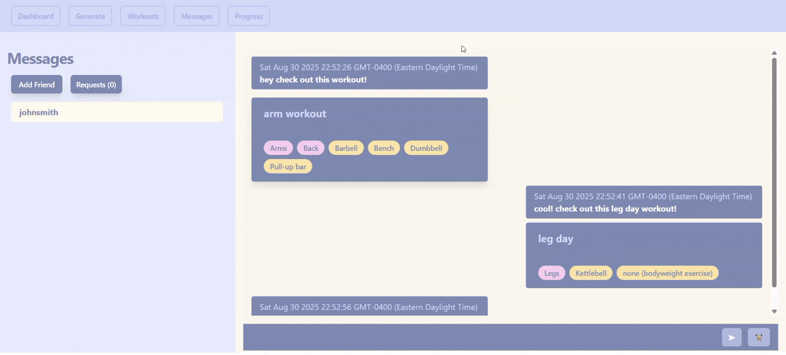

# ([Full Stack Workout App](http://34.73.57.107/))
This simple fitness app lets users create customized workout routines by selecting muscles, equipment, and exercise categories.  Workouts can be saved for later and shared with friends through the live chat feature.

## Why I Built This
Having gained some experience with small frontend and backend tickets through clubs, I wanted to challenge myself through this project by creating a fullstack fitness application.  While my goal was initially to gain a better understanding of backend development, refresh my database skills, and learn about working with public APIs, I was also able to gain exposure to other aspects of web development as well.  By deploying this project on Google Cloud, I was also able to learn more about working with Linux and using NGINX as a reverse proxy for security and management purposes.  Although the frontend was not the focus of this project, I was also able to gain a better understanding of component based architecture and state management in React.

## Technical Skills
<b>Core: </b>JavaScript

<b>Backend: </b>Node.js, Express

<b>Auth/Security: </b>JWT authentication, password hashing (bcrypt), CORS

<b>Realtime Chat: </b>Socket.IO

<b>Database: </b>PostgresSQL, normalized relational schema (FKs, join tables), seeding from external API ([wger](https://wger.de/en/software/api))

<b>Frontend: </b>React, TailwindCSS

<b>Testing: </b>Postman, curl

<b>Deployment: </b>Google Cloud, Linux, NGINX, pm2

## Features

### Create an Account

### Generate Custom Workouts

### Send Messages and Share Workouts

#### Send Friend Requests

#### Accept Friend Requests

#### Chat in Real-Time and Share Workouts

#### Save Shared Workouts

### View Created Workouts

## Improvements
There are definitely several aspects of this project that I would like to improve upon, I have listed a few below.  
### HTTPS behind NGINX
### Data Processing
Some of the workout data is in a different language
  
Some of the exercise descriptions could be shortened for better user experience
### UI Design
Improve design and mobile responsiveness
## Future Features

### Progress Tab 
Stay consistent by scheduling workouts and tracking completion
  
Get stronger by tracking progressive overload

